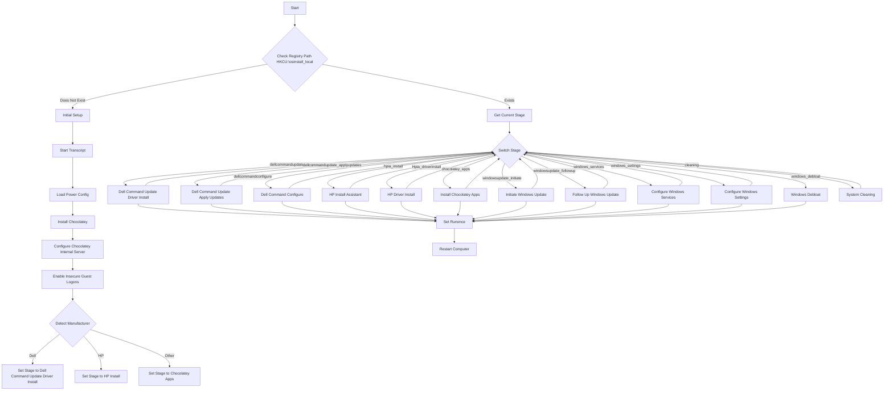

# Win11Install

A script to streamline the installation of Windows 11.

## Table of Contents

- [Introduction](#introduction)
- [Features](#features)
- [Requirements](#requirements)
- [Ventoy-config](#Ventoy-Config)
- [Customisation](#Customisation)
- [Work-Flow](#Work-Flow)
- [Windows-boot-Analysis](#Windows-boot-Analysis)
- [Default-Profile](#Default-Profile)

  
## Introduction

Win11Install is designed to simplify the process of installing Windows 11 by automating tasks and ensuring optimal configuration.

## Features

- Automated installation process
- Pre-configured settings for optimal performance
- Support for various hardware configurations

## Requirements
 - Bios Passwords has to be removed (The script tries to update the BIOS if there is any bios password set , then the script would not be able to complete the process.)
 - The script requires an internet connection to download necessary files from GitHub. Ensure the PC obtains an IP address via DHCP.
 - If the network card drivers are missing, the script may fail to connect to the internet. To resolve this, download the appropriate driver packs and place them in root:\drivers. The unattended XML file is configured to check the root:\drivers folder for drivers during the WinPE setup.
 - Driver pack download:
   
     - Dell : [Dell Family Driver Packs](https://www.dell.com/support/kbdoc/en-us/000180534/dell-family-driver-packs)
     - HP : [HP WinPE Driver Pack](https://ftp.hp.com/pub/caps-softpaq/cmit/HP_WinPE_DriverPack.html)

## Ventoy-Config

  - Ventoy provides the modularity to add an autounttend.xml to a windows iso ( Without Ventoy we need an iso editor to incorporate the xml to the iso)
  - Below image shows how we can use *Ventoyplugson* utility to attribute an autounattend.xml to iso. 
  - 
  - ⚠️ Once after selecting the *unattended.xml* the harddisk will be formatted as instructed in the xml file.	
  - Some time the installation could fail during windows install while configuring the disk partition or at the starting of the header.ps1 due to lack of internet. This happens bacause of the lack of the proper driver.
  - To overcome the driver issue download the corresponding driver packs from the sites below and place it in the \ventoy-root *\drivers* folder.
     - Dell : [Dell Family Driver Packs](https://www.dell.com/support/kbdoc/en-us/000180534/dell-family-driver-packs)
     - HP : [HP WinPE Driver Pack](https://ftp.hp.com/pub/caps-softpaq/cmit/HP_WinPE_DriverPack.html)
  - The *unattended.xml* has a logic implemented to search for the drivers during the windows install.
  - 
    
## Customisation
- When you Fork the registry please change the below paramaters for adapting with your Repository.
- Registryrunonce.ps1 -> *$repopath = "https://raw.githubusercontent.com/vijaidjearam/win11install/main/"* change the value according to your Repo
- Autounattend-WinEdu.xml -> change the value in the *$uri* according to you Repo

  ```xml
	<File path="C:\Windows\Setup\Scripts\unattend-01.ps1">
	$attempts = 0
	do {
	    try {
	        $uri = [uri]::new('https://raw.githubusercontent.com/vijaidjearam/win11install/main/registryrunonce.ps1');
	        $file = 'c:\windows\temp\header.ps1';
	        [System.Net.WebClient]::new().DownloadFile($uri,$file);
	        Write-Host "Download successful!"
	        break
	    } catch {
	        Write-Host "Download failed, retrying..."
	        Start-Sleep -Seconds 5
	    }
	    $attempts++
	} while ($attempts -lt 10)
	</File>
  ```

## Work-Flow

 - The *registryrunonce.ps1* is downloaded and saved as *header.ps1*, this script checks the connectivity of the internet and downloads the *header.ps1* from github and executes.

  - The *set-runonce* function at the end of each stage sets the *header.ps1* at the runonce in the registry.

## Windows-boot-Analysis
  - The below image shows the boot analysis of the image prepared by the script.
  -

## Default-Profile
 - Refer the following [Link](https://vijaidjearam.github.io/blog/windows11/2025/02/28/Copy-desired-profile-to-Default-Profile.html)


